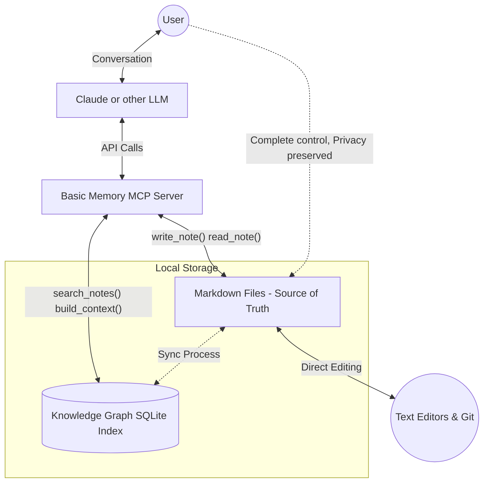

import { Card, CardGroup, Info, Warning, Note, Tip, Accordion, AccordionItem, Steps, Step, CodeGroup, CodeTab } from '@/components'

## Architecture

Basic Memory consists of:

<CardGroup cols={2}>
  <Card title="Core Knowledge Engine">
    Parses and indexes Markdown files
  </Card>
  <Card title="SQLite Database">
    Provides fast querying and search
  </Card>
  <Card title="MCP Server">
    Implements the Model Context Protocol
  </Card>
  <Card title="CLI Tools">
    Command-line utilities for management
  </Card>
</CardGroup>

<Card title="Sync Service">
  Monitors file changes and updates the database
</Card>

<Info>
  The system follows a **file-first architecture** where all knowledge is represented in standard Markdown files and the database serves as a secondary index.
</Info>

## Model Context Protocol (MCP)

Basic Memory implements the [Model Context Protocol](https://github.com/modelcontextprotocol/spec), an open standard for enabling AI models to access external tools:

<CardGroup cols={2}>
  <Card title="Standardized Interface">
    Common protocol for tool integration
  </Card>
  <Card title="Tool Registration">
    Basic Memory registers as a tool provider
  </Card>
  <Card title="Asynchronous Communication">
    Enables efficient interaction with AI models
  </Card>
  <Card title="Standardized Schema">
    Structured data exchange format
  </Card>
</CardGroup>

Integration with Claude Desktop uses the MCP to grant Claude access to your knowledge base through a set of specialized tools that search, read, and write knowledge.

## Licensing

Basic Memory is licensed under the [GNU Affero General Public License v3.0 (AGPL-3.0)](https://www.gnu.org/licenses/agpl-3.0.en.html):

<CardGroup cols={2}>
  <Card title="Free Software">
    You can use, study, share, and modify the software
  </Card>
  <Card title="Copyleft">
    Derivative works must be distributed under the same license
  </Card>
  <Card title="Network Use">
    Network users must be able to receive the source code
  </Card>
  <Card title="Commercial Use">
    Allowed, subject to license requirements
  </Card>
</CardGroup>

<Note>
  The AGPL license ensures Basic Memory remains open source while protecting against proprietary forks.
</Note>

## Source Code

Basic Memory is developed as an open-source project:

<CardGroup cols={2}>
  <Card title="GitHub Repository">
    [https://github.com/basicmachines-co/basic-memory](https://github.com/basicmachines-co/basic-memory)
  </Card>
  <Card title="Issue Tracker">
    Report bugs and request features on GitHub
  </Card>
  <Card title="Contributions">
    Pull requests are welcome following the contributing guidelines
  </Card>
  <Card title="Documentation">
    Source for this documentation is also available in the repository
  </Card>
</CardGroup>

## Data Storage and Privacy

Basic Memory is designed with privacy as a core principle:

<Info>
  **Privacy-First Design:**
  - **Local-First**: All data remains on your local machine
  - **No Cloud Dependency**: No remote servers or accounts required
  - **Telemetry**: Optional and disabled by default
  - **Standard Formats**: All data is stored in standard file formats you control
</Info>

## Implementation Details

Knowledge in Basic Memory is organized as a semantic graph:

<Steps>
  <Step title="Entities">
    Distinct concepts represented by Markdown documents
  </Step>
  <Step title="Observations">
    Categorized facts and information about entities
  </Step>
  <Step title="Relations">
    Connections between entities that form the knowledge graph
  </Step>
</Steps>

This structure emerges from simple text patterns in standard Markdown:

### Example Markdown Input

```markdown
---
title: Coffee Brewing Methods
type: note
permalink: coffee/coffee-brewing-methods
tags:
- '#coffee'
- '#brewing'
- '#methods'
- '#demo'
---

# Coffee Brewing Methods

An exploration of different coffee brewing techniques, their characteristics, and how they affect flavor extraction.

## Overview

Coffee brewing is both an art and a science. Different brewing methods extract different compounds from coffee beans,
resulting in unique flavor profiles, body, and mouthfeel. The key variables in any brewing method are:

- Grind size
- Water temperature
- Brew time
- Coffee-to-water ratio
- Agitation/turbulence

## Observations

- [principle] Coffee extraction follows a predictable pattern: acids extract first, then sugars, then bitter compounds
  #extraction
- [method] Pour over methods generally produce cleaner, brighter cups with more distinct flavor notes #clarity

## Relations

- requires [[Proper Grinding Technique]]
- affects [[Flavor Extraction]]
```

### Parsed JSON Structure

<Accordion>
  <AccordionItem title="Resulting JSON Entity Structure">
    ```json
    {
      "entities": [
        {
          "permalink": "coffee/coffee-brewing-methods",
          "title": "Coffee Brewing Methods",
          "file_path": "Coffee Notes/Coffee Brewing Methods.md",
          "entity_type": "note",
          "entity_metadata": {
            "title": "Coffee Brewing Methods",
            "type": "note",
            "permalink": "coffee/coffee-brewing-methods",
            "tags": "['#coffee', '#brewing', '#methods', '#demo']"
          },
          "checksum": "bfa32a0f23fa124b53f0694c344d2788b0ce50bd090b55b6d738401d2a349e4c",
          "content_type": "text/markdown",
          "observations": [
            {
              "category": "principle",
              "content": "Coffee extraction follows a predictable pattern: acids extract first, then sugars, then bitter compounds #extraction",
              "tags": [
                "extraction"
              ],
              "permalink": "coffee/coffee-brewing-methods/observations/principle/coffee-extraction-follows-a-predictable-pattern-acids-extract-first-then-sugars-then-bitter-compounds-extraction"
            },
            {
              "category": "method",
              "content": "Pour over methods generally produce cleaner, brighter cups with more distinct flavor notes #clarity",
              "tags": [
                "clarity"
              ],
              "permalink": "coffee/coffee-brewing-methods/observations/method/pour-over-methods-generally-produce-cleaner-brighter-cups-with-more-distinct-flavor-notes-clarity"
            }
          ],
          "relations": [
            {
              "from_id": "coffee/coffee-bean-origins",
              "to_id": "coffee/coffee-brewing-methods",
              "relation_type": "pairs_with",
              "permalink": "coffee/coffee-bean-origins/pairs-with/coffee/coffee-brewing-methods",
              "to_name": "Coffee Brewing Methods"
            },
            {
              "from_id": "coffee/flavor-extraction",
              "to_id": "coffee/coffee-brewing-methods",
              "relation_type": "affected_by",
              "permalink": "coffee/flavor-extraction/affected-by/coffee/coffee-brewing-methods",
              "to_name": "Coffee Brewing Methods"
            }
          ],
          "created_at": "2025-03-06T14:01:23.445071",
          "updated_at": "2025-03-06T13:34:48.563606"
        }
      ]
    }
    ```
  </AccordionItem>
</Accordion>

Basic Memory understands how to build context via its semantic graph.

### Entity Model

Basic Memory's core data model consists of:

<CardGroup cols={2}>
  <Card title="Entities">
    Documents in your knowledge base
  </Card>
  <Card title="Observations">
    Facts or statements about entities
  </Card>
  <Card title="Relations">
    Connections between entities
  </Card>
  <Card title="Tags">
    Additional categorization for entities and observations
  </Card>
</CardGroup>

The system parses Markdown files to extract this structured information while preserving the human-readable format.

### Files as Source of Truth

Plain Markdown files store all knowledge, making it accessible with any text editor and easy to version with git.



### SQLite Database

A local SQLite database maintains the knowledge graph topology for fast queries and semantic traversal without cloud dependencies. It contains:

<CardGroup cols={2}>
  <Card title="Knowledge Graph Schema">
    Database tables for the knowledge graph structure
  </Card>
  <Card title="Search Index">
    Full text search index across the knowledge base
  </Card>
</CardGroup>

### Sync Process

The sync process:

<Steps>
  <Step title="Detect Changes">
    Detects changes to files in the knowledge directory
  </Step>
  <Step title="Parse Files">
    Parses modified files to extract structured data
  </Step>
  <Step title="Update Database">
    Updates the SQLite database with changes
  </Step>
  <Step title="Resolve References">
    Resolves forward references when new entities are created
  </Step>
  <Step title="Update Search Index">
    Updates the search index for fast querying
  </Step>
</Steps>

### Search Engine

The search functionality:

<CardGroup cols={2}>
  <Card title="Hybrid Search">
    Uses a combination of full-text search and semantic matching
  </Card>
  <Card title="Comprehensive Indexing">
    Indexes observations, relations, and content
  </Card>
  <Card title="Pattern Matching">
    Supports wildcards and pattern matching in memory:// URLs
  </Card>
  <Card title="Graph Traversal">
    Traverses the knowledge graph to follow relationships
  </Card>
</CardGroup>

<Info>
  Results are ranked by relevance to the query using advanced scoring algorithms.
</Info>

## System Architecture

### Component Interaction

The Basic Memory system is built with a modular architecture:

<CodeGroup>
  <CodeTab label="File Layer">
    **Markdown Files** serve as the source of truth:
    - Human-readable and editable
    - Version control friendly
    - Standard format compatibility
    - Complete data ownership
  </CodeTab>
  <CodeTab label="Processing Layer">
    **Sync Service** processes changes:
    - File system monitoring
    - Markdown parsing
    - Entity extraction
    - Database updates
  </CodeTab>
  <CodeTab label="Storage Layer">
    **SQLite Database** provides:
    - Fast querying capabilities
    - Full-text search indexing
    - Relationship mapping
    - Metadata storage
  </CodeTab>
  <CodeTab label="Interface Layer">
    **MCP Server** exposes:
    - Standardized tool interface
    - Real-time data access
    - Secure authentication
    - Cross-platform compatibility
  </CodeTab>
</CodeGroup>

### Performance Characteristics

<CardGroup cols={3}>
  <Card title="Local Performance">
    All operations are local with no network latency
  </Card>
  <Card title="Scalability">
    Handles knowledge bases with thousands of documents
  </Card>
  <Card title="Resource Efficiency">
    Minimal CPU and memory footprint
  </Card>
</CardGroup>

## Development Philosophy

Basic Memory embodies several key principles:

<Info>
  **Core Principles:**
  - **Local-First**: Your data stays on your machine
  - **Open Standards**: Uses standard formats and protocols
  - **Human-Readable**: Everything is accessible without special tools
  - **AI-Native**: Designed specifically for AI collaboration
  - **Privacy-Preserving**: No data collection or tracking
</Info>